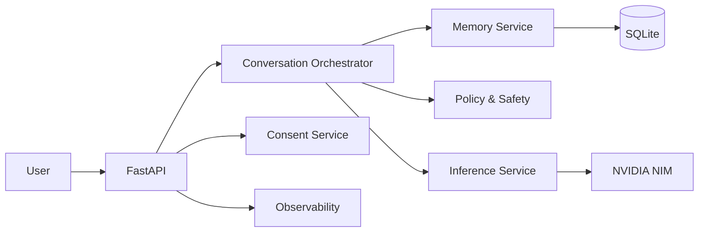

# Aura

Aura is an API-first AI companion focused on persistent memory, semantic retrieval, consent-aware behavior, and adaptive conversation style.

It is built to feel more continuous than a normal chat assistant:
- it remembers relevant context,
- it retrieves semantically similar memories,
- it adapts tone to the user,
- it can use NVIDIA NIM when configured,
- and it falls back safely when model access is unavailable.

## Why this exists

Most assistants reset too often. Aura is designed to keep continuity across sessions without turning the whole experience into a rigid persona script.

## What it can do

- Hold a conversation through a local chat loop or API
- Store and retrieve long-term memory with semantic RAG
- Use NVIDIA NIM for live generation when configured
- Adjust tone dynamically based on user cues
- Enforce privacy controls like GPC and one-click opt-out
- Keep audit events for observability
- Expose a clean FastAPI surface for integration work

## Quick demo

### 1. Start it

```powershell
.\run_aura_chat.ps1
```

### 2. Talk to it

Try prompts like:
- `talk normal`
- `give me the short version`
- `step by step plan for today`
- `I need help thinking through this`

### 3. Inspect the API

Open:
- `http://127.0.0.1:8000/docs`

## Features

### Conversation
- JWT-authenticated conversation API
- Dynamic style adaptation
- Safety-aware response shaping

### Memory
- Persistent SQLite-backed memory
- Semantic retrieval with embeddings
- Top-k context grounding for each turn

### Governance
- GPC and one-click opt-out support
- Purge receipts and audit events
- Consent-aware processing gates

### Model support
- NVIDIA NIM chat completions
- NVIDIA NIM embeddings for semantic RAG
- Local fallback if model access is unavailable

## Architecture snapshot



## Configuration

Set these environment variables if you want to customize runtime behavior:

- `NIM_API_KEY` or `NVIDIA_NIM_API_KEY`: NVIDIA NIM API key
- `NVIDIA_NIM_MODEL`: chat model name
- `NVIDIA_NIM_EMBED_MODEL`: embedding model name
- `AURA_RAG_TOP_K`: number of retrieved memories to inject
- `AURA_DATABASE_PATH`: SQLite database path
- `AURA_JWT_SECRET`: JWT signing secret

## Example request

```bash
curl -X POST "http://127.0.0.1:8000/v1/auth/token" \
  -H "Content-Type: application/json" \
  -d '{"username":"admin","password":"admin123"}'
```

## Project status

This is a working prototype with:
- live API endpoints,
- persistence,
- semantic RAG,
- and a local interactive chat launcher.

It is not yet a full production system.

## Files worth opening first

- [app/main.py](app/main.py)
- [app/services/inference_service.py](app/services/inference_service.py)
- [app/services/memory_service.py](app/services/memory_service.py)
- [app/services/embedding_service.py](app/services/embedding_service.py)
- [app/services/orchestrator_service.py](app/services/orchestrator_service.py)
- [run_aura_chat.ps1](run_aura_chat.ps1)

## Safety note

Do not commit secrets. Rotate any exposed keys before sharing the repository publicly.
